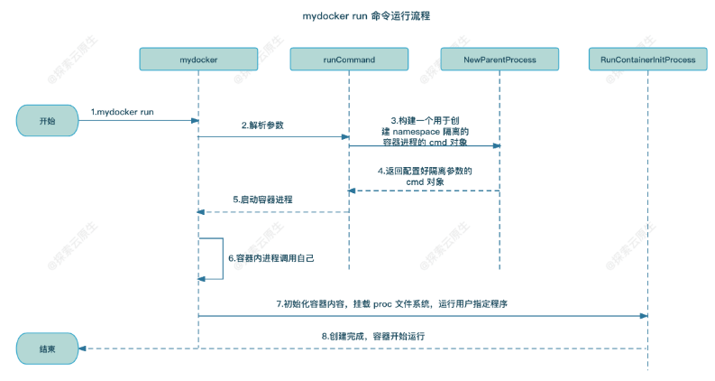

## 参考

- 《动手写 docker》
- [从零开始写 Docker(一)---实现 mydocker run 命令 -](https://www.lixueduan.com/posts/docker/mydocker/01-mydocker-run/)

## 设计思路

- 1）流程开始，用户手动执行 mydocker run 命令
  - 例如 mydocker run -it /bin/sh
    - 首先对该 cmd 对象进行分解，进行初步了解
    - command 部分为 mydocker run （ 此处表示执行 mydocker 程序的 run 逻辑部分）
    - flags 部分为 -it  (flags 可以理解为命令的可选功能，此处就是将进程的输入输出展示到终端上)
    - args 部分为 /bin/sh
- 2）urfave/cli 工具解析传递过来的参数
- 3）解析完成后发现第一个参数是 run，于是执行 run 命令，调用 runCommand 方法，该方法中继续调用 NewParentProcess 函数构建一个 cmd 对象
  - 以上面为例
  - Mydocker run 会调用 runCommand 方法，继续调用 NewParentProcess 函数，
    - NewParentProcess 函数，会重新构建一个 cmd 命令对象（增加 init 逻辑），新建的 cmd 命令对象会构建一个隔离的 namespace 空间，并增加 init 逻辑的触发
    - 新建的 cmd 对象为 /proc/self/exe init /bin/sh，command 部分为  /proc/self/exe init（就相当于 mydocker init），args 保持不变，为用户传入的（/bin/sh)
    - 同时该命令 mydocker run 为该 cmd 配置了一些属性，如固定要配置的属性（ mnt/net/uts/pid/ipc 等 namespace），和一些可选的属性（由 flags 参数控制，如输入输出重定向等，-it 是控制是否将输入输出转到标准输出（也就是终端上））
    - 因此该 cmd 对象运行后，就相当于利用 namespace 机制创建一个隔离的进程空间，在该进程空间内执行的是（/proc/self/exe init 逻辑），也就是（mydocker 的 init 逻辑），
- 4）NewParentProcess 将构建好的 cmd 对象返回给 runCommand 方法
- 5）runCommand 方法中调用 cmd.exec 执行上一步构建好的 cmd 对象
- 6）容器启动后，根据 cmd 中传递的参数，/proc/self/exe init 实则最终会执行 mydocker init 命令，初始化容器环境
  - 因此该 cmd 对象运行后，就相当于利用 namespace 机制创建一个隔离的进程空间，在该进程空间内执行的是（/proc/self/exe init 逻辑），也就是（mydocker 的 init 逻辑）
  - 但有个问题，在该进程内部 mydocker  init 是 PID 1 进程，但实际上 PID 1 应该为用户进程，也就是 /bin/sh
    - 因此 mydocker  init 对应的逻辑，就是将通过 exec 系统调用，将 PID 1 的进程替换为用户程序（也就是 /bin/sh）
- 7）init 命令内部实现就是通过 mount 命令挂载 proc 文件系统
  - proc 文件系统中的文件是内核自动生成，保存的是进程信息，通过 ps 可以查看；若没有再次挂载，通过 ps 查看到的将会是宿主机上的所有进程；再次挂载后，便可以看到容器进程内的进程信息
- 8）容器创建完成，整个流程结束