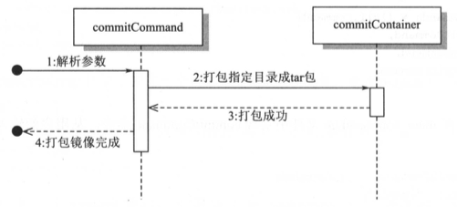

## 参考

- [从零开始写 Docker(四)---使用 pivotRoot 切换 rootfs 实现文件系统隔离 -](https://www.lixueduan.com/posts/docker/mydocker/04-change-rootfs-by-pivot-root/)


## 1 | 更改 rootfs

- [从零开始写 Docker(四)---使用 pivotRoot 切换 rootfs 实现文件系统隔离 -](https://www.lixueduan.com/posts/docker/mydocker/04-change-rootfs-by-pivot-root/)

1. 准备 rootfs，从现有 busybox 镜像中导出文件系统

   - ``` sh
     docker pull busybox
     # 执行一个交互式命令，让容器能一直后台运行
     docker run -d busybox top
     # 拿到刚创建的容器的 Id
     containerId=$(docker ps --filter "ancestor=busybox:latest"|grep -v IMAGE|awk '{print $1}')
     echo "containerId" $containerId
     # export 从容器导出
     docker export -o busybox.tar $containerId
     
     mkdir busybox
     tar -xvf busybox.tar -C busybox/
     ```

2. 挂载 rootfs，使用 pivot_root 系统调用，将旧的 rootfs 改为新的 rootfs（busybox 文件系统）

   - 注意 pivot_root 系统调用，需要新旧 rootfs 在不同的文件系统中，因此通过 bind-mount 在老的 rootfs 中新建一个挂载点（表现为两个不同的文件系统）
   - 之后创建一个目录，用于 旧rootfs 挂载，便于之后清理旧 rootfs 

3. 利用 cmd.Dir 参数，为 init 命令配置工作目录（新 rootfs，注意此处有坑，应该为宿主机上的 busybox 目录路径），这样便于后续进行 新旧 rootfs 的切换

### 存在的问题

- Pivot-root 切换 rootfs 后，更改 rootfs 中的文件会影响宿主机对应的目录（可以理解为，会影响镜像的只读层）


## 2 | 利用 overlayfs 构建容器读写层

[从零开始写 Docker(五)---基于 overlayfs 实现写操作隔离 -](https://www.lixueduan.com/posts/docker/mydocker/05-isolate-operate-by-overlayfs/)

1. 上面的镜像 busybox.tar 解压的目录，作为 lower layer（只读层）

2. 创建 upper 和 work 目录，这两个作为容器的读写层，upper 目录负责写入的新文件，work 目录用于临时的操作处理（可以理解为缓存层，处理并发读写之类）

3. 通过 overlay 实现联合挂载，挂载最终的 mnt 目录

   ``` sh
   mount -t overlay overlay -o lowerdir=/go-code/my-docker/busybox,upperdir=/go-code/my-docker/upper,workdir=/go-code/my-docker/work /go-code/my-docker/mnt
   ```

4. 这样解决了上面的问题，创建容器后，在容器内写入文件，不会影响镜像层（只读层），只会写入到 upper 目录（读写层）


### 2.1 遇到的问题

- 问题：由于采用 mac，利用 parallel 运行 ubuntu 20 虚拟机，通过 parallel 共享宿主机目录到虚拟机内，同时直接在虚拟机内共享目录编译执行代码，由于该目录是fuse.prl_fsd 文件系统，无法进行 overlay 挂载，所以在运行过程汇总报错

- 解决：虚拟机 ubuntu 内其他目录是 ext4 文件系统，所以将该代码从共享目录复制到其他目录执行，即可解决 overlay 无法挂载问题

- 避免手动同步费力，所以简单写个 syn.sh 脚本

  - ``` sh
    # 源 /media/psf/my-docker/  是共享目录
    # 目标 /go-code/my-docker/ 是ubuntu虚拟机内目录
    # 每次需要同步时，执行一次该脚本即可
    rsync -av --delete /media/psf/my-docker/ /go-code/my-docker/
    ```

## 3 | 为容器配置 volume

1. 添加 -v 参数
2. 解析 -v 参数，分割宿主机目录和容器目录
3. 通过-v 分割出容器目录结合 overlayfs merged 目录，得到容器目录对应的宿主机目录位置（若不存在此目录，就创建）
4. 将宿主机目录通过 bind mount
5. 容器结束时，注意先 umount 容器目录，直接删除目录会清理掉宿主机上对应的目录
6. 代码优化：将第二节的 mnt 目录，重命名为 merged 目录，这样更容易理解和明白，其是 overlayfs 形成的最终目录，也是容器的 rootfs

``` sh
$ go build .
$ mkdir volume && cd volume && pwd
/go-code/my-docker/volume
$ ./my-docker run -it -v /go-code/my-docker/volume:/root/volume sh
$ cd /root/volume 
$ echo hello > hello1.txt
$ exit
# 查看宿主机 /go-code/my-docker/volume 是否有个 hello1.txt 文件，内容是否一致，一致就符合要求
```

## 4 | 打包镜像

- [从零开始写 Docker(七)---实现 mydocker commit 打包容器成镜像 -](https://www.lixueduan.com/posts/docker/mydocker/07-mydocker-commit/)

1. 新建个 Command，执行对应的容器镜像打包函数
2. 镜像打包函数：实际就是将容器对应的宿主机 merged 目录，用 tar 进行打包

``` sh
# 开启终端1
$ ./sync.sh
$ go build .
$ ./my-docker run -it sh
$ echo KubeExplorer > tmp/hello.txt
$ cat /tmp/hello.txt
KubeExplorer

# 新开个终端2 查看打包后的镜像
$ ./my-docker commit myimage
commitContainer imageTar: /go-code/my-docker/imagetar/myimage.tar
# -t 列出 tar 归档中的文件，而不解压; -f 指定 tar 文件
$ tar -tf imagetar/myimage.tar |grep hello.txt
./tmp/hello.txt
```

