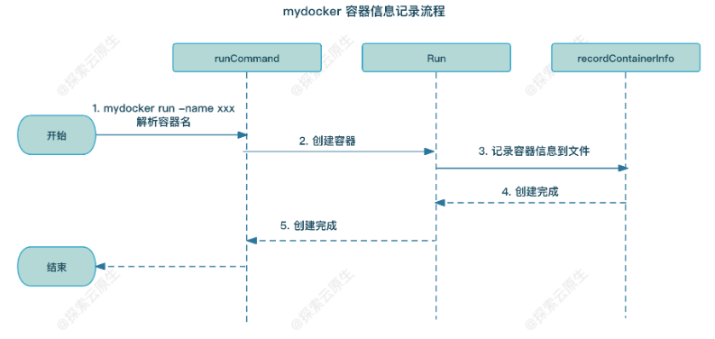
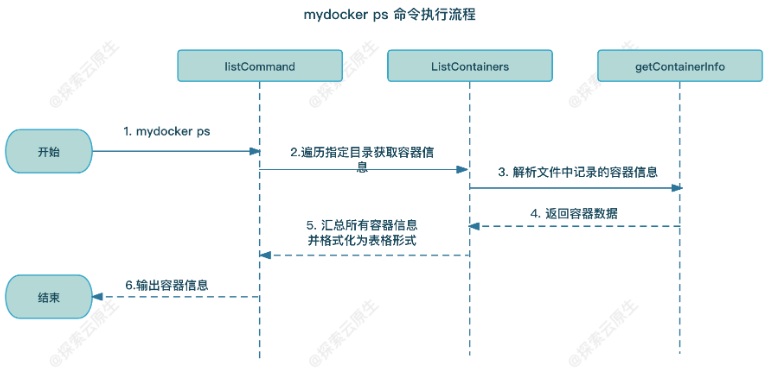

## 1. 容器 detach（-d 参数）

- [从零开始写 Docker(八)---实现 mydocker run -d 支持后台运行容器 -](https://www.lixueduan.com/posts/docker/mydocker/08-mydocker-run-d/)

1. 容器进程的启动逻辑是  mydocker run --> mydocker init（替换为容器实际的进程），简化为 mydocker 主程序进程 --> 容器进程
2. -d 指的是 detach，目前功能有限，-it 和 -d 参数不能同时使用（-it 指的是前台与容器进程交互，-d 指的是容器进程后台运行）
3. 此处容器后台运行，实际上就是将 mydocker 主程序进程杀死，让容器进程被宿主机 1 号进程纳管
   - 因此有个 bug：容器进程结束后，相应的 overlayfs 目录和 cgroup 等资源无法进行清理
   - 个人理解：此处与 docker 的 -d （容器进程后台运行）有差异，此处 -d 相当于模拟 docker 主进程被杀死后，容器进程被宿主机1号进程纳管

## 2. 容器信息记录（-name 参数，模拟 ps）

- [从零开始写 Docker(九)---实现 mydocker ps 查看运行中的容器 -](https://www.lixueduan.com/posts/docker/mydocker/09-mydocker-ps/)

### 2.1 持久化容器信息到宿主机 json 文件

1. 利用随机函数创建容器 ID（containerID）
2. run 命令增加参数 -name，可指定容器名称
3. 创建容器，记录容器信息（containerID 和 containerName 等，若未指定 -name， containerName=containerID）到宿主机上指定的 config.json 中

``` sh
$ go build .
$ ./my-docker run -it -name test sh
{"level":"debug","msg":"Current containerID is [4254293419]","time":"2025-02-28T15:09:22+08:00"}
{"level":"debug","msg":"ContainerInfo save path: /var/lib/mydocker/containers/4254293419/config.json","time":"2025-02-28T15:09:22+08:00"}

# 新开启个终端
# 上面容器终止退出后，该文件会被清理掉
$ cat /var/lib/mydocker/containers/4254293419/config.json
{"pid":"63051","id":"4254293419","name":"test","command":"sh","createdTime":"2025-02-28 15:09:22","status":"running"}
```



### 2.2 实现 ps 命令

- 上面容器启动把信息存储在`var/lib/mydocker/containers` 目录下

此处逻辑为

- 添加 ps 命令，并增加对应的处理函数，处理函数就是下面的几点运行逻辑

1. 读取 `var/lib/mydocker/containers` 目录下的所有文件夹就能拿到当前系统中的容器
2. 读取`/var/lib/mydocker/containers/{containerID}/config.json` 文件即可拿到对应容器的详细信息。
3. 将进行 json 解析，再打印出来，即可展示容器的运行信息




### 3.2 实现 rm 命令

- 备注：该命令执行前，要停止容器进程（stop），否则容器进程占用目录，无法完成目录的清理

1. 清理 cgroup 目录
2. 清理 volume 和 overlayfs 目录
3. 清理容器信息 json 文件

### 3.3 执行过程

``` sh
# 用 detach 方法运行容器，容器进程会被宿主机 1 号进程纳管
root@dfy-1:/go-code/my-docker# ./my-docker run -d top
{"level":"info","msg":"Run comand args[0]: [top]","time":"2025-03-03T10:41:19+08:00"}
{"level":"info","msg":"resConf:\u0026{ 0  }","time":"2025-03-03T10:41:19+08:00"}
{"level":"debug","msg":"Overlay mount Cmd: /usr/bin/mount [mount -t overlay overlay -o lowerdir=/go-code/my-docker/busybox,upperdir=/go-code/my-docker/upper,workdir=/go-code/my-docker/work /go-code/my-docker/merged] ","time":"2025-03-03T10:41:19+08:00"}
{"level":"debug","msg":"Current containerID is [4153757690]","time":"2025-03-03T10:41:19+08:00"}
{"level":"debug","msg":"ContainerInfo save path: /var/lib/mydocker/containers/4153757690/config.json","time":"2025-03-03T10:41:19+08:00"}
{"level":"info","msg":"command all is top","time":"2025-03-03T10:41:19+08:00"}

# 省略若干信息展示，可以看出 容器进程会被宿主机 1 号进程纳管
/go-code/my-docker# pstree -pl
systemd(1)─┬─accounts-daemon(714)─┬─{accounts-daemon}(721)
           │                      └─{accounts-daemon}(778)
           ├─top(67732)
           └─unattended-upgr(967)───{unattended-upgr}(1052)
           
# 查看容器 json 文件，验证 pid 是一致的
/var/lib/mydocker/containers# cat 4153757690/config.json
{"pid":"67732","id":"4153757690","name":"4153757690","command":"top","createdTime":"2025-03-03 10:41:19","status":"running","volume":""

# stop 命令停止容器
/go-code/my-docker# ./my-docker stop 4153757690
{"level":"debug","msg":"Container json file path: /var/lib/mydocker/containers/4153757690/config.json","time":"2025-03-03T10:54:30+08:00"}

# 容器 json 文件状态改为 stopped
/var/lib/mydocker/containers# cat 4153757690/config.json
{"pid":" ","id":"4153757690","name":"4153757690","command":"top","createdTime":"2025-03-03 10:41:19","status":"stopped","volume":""}

# 移除容器，清理目录
/go-code/my-docker# ./my-docker rm 4153757690
{"level":"debug","msg":"Container json file path: /var/lib/mydocker/containers/4153757690/config.json","time":"2025-03-03T10:55:12+08:00"}
{"level":"info","msg":"Staring Resource-Cleanning ...","time":"2025-03-03T10:55:12+08:00"}
{"level":"info","msg":"Cleaning mydocker-cgroup subsystem-cgroup-dirs","time":"2025-03-03T10:55:12+08:00"}
{"level":"info","msg":"Cleaning memory-cgroup-dir [/sys/fs/cgroup/memory/mydocker-cgroup]","time":"2025-03-03T10:55:12+08:00"}
{"level":"info","msg":"Finsh clean mydocker-cgroup subsystem-cgroup-dirs","time":"2025-03-03T10:55:12+08:00"}
{"level":"debug","msg":"Remove container overlayfs mountPoint and writeLayer.","time":"2025-03-03T10:55:12+08:00"}
{"level":"info","msg":"Finsh Container Resource Clean.","time":"2025-03-03T10:55:12+08:00"}

# 可以看到容器 json 文件也不存在了
/var/lib/mydocker/containers# ls
/var/lib/mydocker/containers#
```

## 4. 实现 logs 命令

- [从零开始写 Docker(十)---实现 mydocker logs 查看容器日志 -](https://www.lixueduan.com/posts/docker/mydocker/10-mydocker-logs/)

1. 非 tty 形式，也就是 detach 形式，将 stdout 和 stderr 重定向到指定的宿主机 log 文件，容器日志写入该文件
2. logs 命令 —— 读取上面的 log 文件，输出到 os.Stdout，也就是打印到屏幕上

## 5. 实现 exec 命令

- [从零开始写 Docker(十一)---实现 mydocker exec 进入容器内部 -](https://www.lixueduan.com/posts/docker/mydocker/11-mydocker-exec/)

### 5.1 实现过程

1. exec 命令实现是将当前进程通过 setns 命令放入到容器的 linux  namespace 中，从而与容器进程进行交互，进入了容器进程的 namespace 隔离环境中
2. 难点1在于： 多线程的进程无法使用 setns 命令，而 go 程序由于 runtime 机制，默认会启动多个内核级线程（M），因此为了解决此问题，采用了 cgo
3. 解决思路：cgo 机制可以使用 c 语言，c 语言是单线程，因此用 c 语言执行 setns 命令，将当前进程放入到容器 namespace 中，之后再执行用户 exec 命令参数，也就是启动 exec 用户指定的进程
4. 难点2：c 包裹着 go 程序 —— 就需要 c 代码段先执行，因此 c 代码段会加`__attribute__((constructor))` 开头，表示代码运行就执行，类似构造函数；但是只有 exec 命令需要此部分函数，run、stop、ps 都不需要此函数，若 C 代码在这些命令前都执行，那就会产生问题
5. 解决思路：仍是让 C 代码先执行，不过C 代码部分增加个环境变量判断（有配置该环境变量，就会执行 setns 逻辑）；因为默认都为配置该环境变量，所以先执行 go 程序（此时所有命令都正常运行）；当执行 exec 命令时，配置该环境变量，但是 C 代码已经运行过了，如何再次运行？？ —— 答，`/proc/self/exe`，通过该参数用户可再次重新运行当前程序，相当于重启个新进程，因此也会重新运行 C 代码逻辑，因此可以使用 setns 进入到容器进程的 namespace 内，在容器进程内运行 exec 命令指定的用户参数（该参数也是通过 exec 配置的环境变量传入的），因此相当于在容器进程 namespace 中启动了用户指定的进程

### 5.2 补充知识

#### 5.2.1 什么是 cgo

`cgo` 是 Go 语言提供的一个特性，允许 Go 代码调用 **C 代码、C 语言库**，从而**实现 Go 和 C 语言的互操作**。

在 Go 代码中，`cgo` 通过 `import "C"` 语句引入 C 代码，可以：

- 调用 C 语言的函数、结构体和变量。
- 访问 C 语言库（如 `libc`、`sqlite`、`openssl` 等）。
- 在 Go 代码中嵌入 C 代码片段。

#### 5.2.2 cgo使用举例说明

- `import "C"` 上面的 `/* ... */` 是 C 代码，会被 `cgo` 解析并编译。

- `C.hello()` 直接调用 C 代码中的 `hello()`。
- 可以使用 `#cgo` 指令来链接外部 C 库
- `#cgo LDFLAGS: -lm` 让 `cgo` 连接 `libm`（数学库）。
- `C.sqrt(16)` 直接调用 C 的 `sqrt()`。

``` go
// 举例1. 调用 C 语言函数
// - import "C"` 上面的 `/* ... */` 是 C 代码，会被 `cgo` 解析并编译。
// - `C.hello()` 直接调用 C 代码中的 `hello()`。
// - C语言的代码要用 /* ... */ 括起来
package main

/*
#include <stdio.h>
void hello() {
    printf("Hello from C!\n");
}
*/
import "C"

func main() {
    C.hello()  // 调用 C 语言的 hello() 函数
}

// 举例2. 访问 C 语言库
// - 可以使用 `#cgo` 指令来链接外部 C 库
// - `#cgo LDFLAGS: -lm` 让 `cgo` 连接 `libm`（数学库）。
// - `C.sqrt(16)` 直接调用 C 的 `sqrt()`。
package main

/*
#cgo LDFLAGS: -lm  // 链接 C 语言的数学库（libm）
#include <math.h>
*/
import "C"
import "fmt"

func main() {
    result := C.sqrt(16)  // 调用 C 语言的 sqrt() 函数
    fmt.Println("Sqrt(16) =", result)
}

```

### 5.3 本模块使用 cgo 的原因

#### 5.3.1为什么要使用 cgo

- 对于 Mount Namespace 来说， 一个具有 多线程的进程是无法使用 setns 调用进入到对应的命名空间的。 但是， Go 每启动一个程序就会 进入多线程状态， 因此无法简简单单地在 Go 里面直接调用系统调用， 使当前的进程进入对应 的 Mount Namespace。 这里需要借助 C 来实现这个功能 。
- 是否可以将 go 进程变为单线程
   - 答 —— 不可以
      - 简单说，go runtime 是 GMP 模型，G 指的是 goroutine（用户级线程），M 指的是 内核级线程，P 是将 G 调度到 M 上来完成工作
      - 所以也就是说 Go 运行时默认多线程 —— 会启动 多个M（内核级线程）
      - 因此即使只有一个 goroutine，实现也是有多个 M —— 也就是多线程 —— 因此无法使用 setns
   - 因为 Go 运行时默认启动了多线程（多 goroutine 调度）
      - Go 语言的运行时会默认创建多个线程（M 结构），并在这些线程上调度 goroutines（G 结构）。
      - 即使你的 Go 代码看似只有一个 goroutine，Go 运行时仍可能会创建多个线程（特别是在 GOMAXPROCS > 1 时）。
      - 由于 Linux 规定 多线程进程不能用 setns 进入 Mount Namespace，所以 Go 进程很难直接调用 setns 进入目标命名空间。
   - Go 不能简单地 "停用" 其他线程
      - Go 运行时会动态管理线程，无法完全保证 setns 运行时只有一个线程。
      - 即使你在 main 线程中调用 runtime.LockOSThread() 绑定当前 goroutine 到一个线程，这个线程仍然属于一个多线程进程，所以 setns 仍然会失败。
- C 代码可以创建单线程进程
   - C 代码可以作为一个“包装器”来启动 Go 代码，确保 Go 进程在进入 Mount Namespace 之后再执行
      - C 代码（单线程进程）先进入 Mount Namespace（通过 setns）。
      - C 代码再 exec 启动 Go 代码（这样 Go 进程会在新的 Mount Namespace 内运行）
- 过程
   1. C 代码 setns 成功后，exec 启动 Go 进程，初始状态是单线程的。
   2. Go 进程在运行后可能会创建新的线程，但这不会影响它已经在新的 Mount Namespace 里。

#### 5.3.2 如何使 C 代码包装 go 代码

1. 首先就是要保证 C 代码在 go 代码前执行（类似构造函数，程序运行时首先就会启动 C 代码）
2. 考虑个问题 —— 只有 exec 命令会需要使用 C 代码，而其他命令不需要 C 代码，C 代码的执行会影响该项目的其他命令
3. 解决方案 —— 在这段 C 代码前面一开始的位置就添加了环境变量检测，没有对应的环境变量时，就直接退出
   - 对于不使用 exec 功能的 Go 代码 ，只要不设置对应的环境变量 ， 那么当 C 程序检测到没有这个环境变量时，就会直接退出， 继续执行原来的代码， 并不会影响原来的逻辑。
   - 对于我们使用 exec 来说，当容器名和对应的命令传递进来以后，程序已经执行了，而且 那段 C 代码也应该运行完毕。那么，怎么指定环境变量让它再执行一遍呢？这里就用到了这 个／proc/self/exe 。这里又创建了一个 command ， 只不过这次只是简单地 fork 出来一个进程，不 需要这个进程拥有什么命名空间的隔离，然后把这个进程的标准输入输出都绑定到宿主机上 。 这样去 run 这里的进程时，实际上就是又运行了 一遍自己的程序，但是这时有一点不同的就是， 再一次运行的时候已经指定了环境变量，所以 C 代码执行的时候就能拿到对应的环境变量 ， 便可以进入到指定的 Namespace 中进行操作了

## 6. 优化 rm 命令

1. 在上面 stop 命令基础上，优化 rm 命令
2. mydocker rm contaienr-id  只能清理 stopped 状态的容器残留资源（需要先执行 mydocker stop container-id
3. 新增 -f 参数，强制删除，mydocker rm -f contaienr-id 可清理 running 状态的容器残留资源

## 7. 优化 overlayfs（实现容器间 rootfs 隔离）

- [从零开始写 Docker(十四)---重构：实现容器间 rootfs 隔离 -](https://www.lixueduan.com/posts/docker/mydocker/14-isolation-rootfs-between-containers/)

1. 以往代码程序都是使用指定的 overlayfs 目录（如 upper、lower、work、merged 等目录是写死的），因此只能创建一个容器
2. 现在改为动态的，会为每个容器根据容器id创建一个目录，存放 overlayfs 相关目录，因此现在每个容器都有自己的 merged 目录，实现了 rootfs 隔离
3. 修改之处在 overlayfs 相关目录使用地方，另外优化了 commit 命令（也会为每个容器创建对应的镜像打包目录）
4. 待做：虽然现在实现了 rootfs 隔离，但并未实现 cgroupfs 隔离（仍是写死的目录，没有为每个容器创建单独的目录），所以若配置 -mem 等信息，多个容器仍会有问题，此问题后续进行优化
5. 新知识点 —— log.Fatal = log.Info + os.Exit(1) ，也就是若使用 log.Fatal ，打印信息后会自动终端程序，避免继续执行

``` sh
$ mkdir -r /var/lib/mydocker/image
# 需要将镜像提前防止到此处
$ cp busybox.tar /var/lib/mydocker/image/
$ ls /var/lib/mydocker/image
# 运行容器
$ ./my-docker run -it busybox sh
# 查看容器
$ ./my-docker ps
# 打包容器为镜像
$ ./my-docker commit 4782854783 busybox-2
commitContainer imageTar: /var/lib/mydocker/image-tar/4782854783/busybox-2.tar
# 停止并移除容器
$ ./my-docker rm -f 4782854783
```

## 8. 增加 -e 设置环境变量

1. 增加 -e 为容器进程设置环境变量
2. 引入个问题：exec 进入容器进程后，无法获取到容器进程内的已设置的环境变量
3. 解决方法：在 exec 命令对应的响应函数中，通过容器 pid 获取容器进程已设置的环境变量，然后设置到exec对应的进程中；不过后续容器进程环境变量的新增或改动，不会同步到 exec 进程中

``` sh
# 启动容器
$ ./my-docker run -it -e s1=hello -e s2=world busybox sh
# 查看环境变量
$ echo $s1 $s2
hello world

# exec 进入容器，并查看环境变量, 是一致的
$ ./my-docker exec 4541869436 sh
$ echo $s1 $s2
hello world
```

