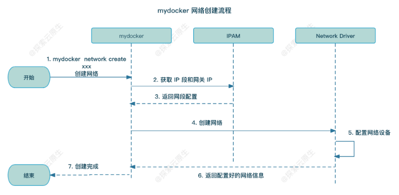
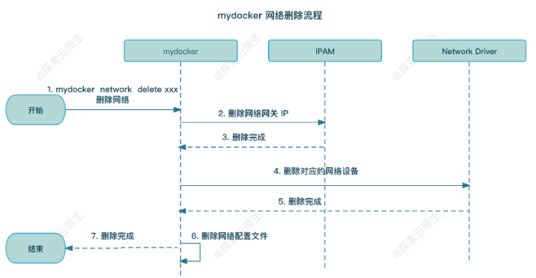

## 当前配置目录

``` sh
# ipam 默认目录
/var/lib/mydocker/network/ipam/
# ipam json 文件 ——  subnet名称和对应的bitmap形式的 ip 分配情况
cat /var/lib/mydocker/network/ipam/subnet.json

# network 默认目录
/var/lib/mydocker/network/network
# 文件名称就是对应的 network 名称，记录（网络名称，ip段、驱动名称），如 testbr0 
cat /var/lib/mydocker/network/network/testbr0
```


## 测试创建网桥分配 ip 和删除网桥

### 实现流程

1. create：创建网络

   - 首先是使用 IPAM 分配 IP（注意网段前后不可分配，如 192.168.0.0/24  中 192.168.0.0（一般用于表示网段，配置到路由表中），192.168.0.255 表示广播地址；所以网关IP 一般为可分配的第一位，就是 192.168.0.1/24）

   - 然后根据 driver 找到对应的 NetworkDriver 并创建网络（这里只实现了 bridge driver，所以采用此 driver 创建网络设备并配置上网关IP）

   - 最后将网络信息保存到文件（当前默认存储路径为 `/var/lib/mydocker/network/network/`,文件名称为网络名称）
   - 

2. list：查看当前所有网络信息

   - 扫描网络配置的目录`/var/lib/mydocker/network/network/`拿到所有的网络配置信息并打印即可

3. remove：删除网络

   - 先调用 IPAM 去释放网络所占用的网关 IP
   - 然后调用网络驱动去删除该网络创建的一些设备与配置
   - 最终从网络配置目录中删除网络对应的配置文件
   - 

### 测试

``` sh
root@dfy-1:/go-code/my-docker#
# 1. 使用 bridge 驱动，创建网络，同时指定网段为 192.168.0.0/24，创建出的网桥名称为 testbr0
root@dfy-1:/go-code/my-docker# ./my-docker network create --subnet 192.168.0.0/24 --driver bridge testbr0
{"level":"debug","msg":"Allocate IP ... ...","time":"2025-03-13T17:11:17+08:00"}
{"level":"debug","msg":"Dump Network-IPAM-Info to File: /var/lib/mydocker/network/ipam/subnet.json","time":"2025-03-13T17:11:17+08:00"}
{"level":"debug","msg":"Allocate IP Finish —— subnet: 192.168.0.1/24, get free ip: 192.168.0.1","time":"2025-03-13T17:11:17+08:00"}
{"level":"debug","msg":"initBridge gatewayIP: 192.168.0.1/24","time":"2025-03-13T17:11:17+08:00"}
{"level":"debug","msg":"Dump Network-testbr0-Info to File: /var/lib/mydocker/network/network/testbr0","time":"2025-03-13T17:11:17+08:00"}
# 查看 ip 分配情况，192.168.0.0 网段（一般配置到路由表中） 192.168.0.255（广播地址），这两个 IP 默认是不分配的，也就是第一位和最后一位默认置为1
# 因此分配的 IP 为 192.168.0.1，也就是网关 IP
root@dfy-1:/go-code/my-docker# cat /var/lib/mydocker/network/ipam/subnet.json
{"192.168.0.0/24":"1100000000000000000000000000000000000000000000000000000000000000000000000000000000000000000000000000000000000000000000000000000000000000000000000000000000000000000000000000000000000000000000000000000000000000000000000000000000000000000000000000000000000001"}
# 创建的网络信息存储在宿主机以此网络命名的文件中， ////AA== 是 base64编码，表示 24
root@dfy-1:/go-code/my-docker# cat /var/lib/mydocker/network/network/testbr0
{"Name":"testbr0","IPRange":{"IP":"192.168.0.1","Mask":"////AA=="},"Driver":"bridge"}root@dfy-1:/go-code/my-docker#
root@dfy-1:/go-code/my-docker#
# 可以看出，创建出 网桥testbr0
root@dfy-1:/go-code/my-docker# ip link show
1: lo: <LOOPBACK,UP,LOWER_UP> mtu 65536 qdisc noqueue state UNKNOWN mode DEFAULT group default qlen 1000
    link/loopback 00:00:00:00:00:00 brd 00:00:00:00:00:00
2: enp0s5: <BROADCAST,MULTICAST,UP,LOWER_UP> mtu 1500 qdisc fq_codel state UP mode DEFAULT group default qlen 1000
    link/ether 00:1c:42:1d:ce:71 brd ff:ff:ff:ff:ff:ff
18: testbr0: <BROADCAST,MULTICAST,UP,LOWER_UP> mtu 1500 qdisc noqueue state UNKNOWN mode DEFAULT group default qlen 1000
    link/ether 86:d6:cf:f0:55:38 brd ff:ff:ff:ftestbr0
# 查看网桥 IP，使我们想要配置的 192.168.0.1/24，后面 192.168.0.255 表示广播地址
root@dfy-1:/go-code/my-docker# ip addr show testbr0
18: testbr0: <BROADCAST,MULTICAST,UP,LOWER_UP> mtu 1500 qdisc noqueue state UNKNOWN group default qlen 1000
    link/ether 86:d6:cf:f0:55:38 brd ff:ff:ff:ff:ff:ff
    inet 192.168.0.1/24 brd 192.168.0.255 scope global testbr0
       valid_lft forever preferred_lft forever
    inet6 fe80::84d6:cfff:fef0:5538/64 scope link
       valid_lft forever preferred_lft forever
root@dfy-1:/go-code/my-docker#
# 2. 查看网络，符合上面的创建信息
root@dfy-1:/go-code/my-docker# ./my-docker network list
{"level":"debug","msg":"Try load Network-testbr0-ConfigFile: /var/lib/mydocker/network/network/testbr0","time":"2025-03-13T17:14:29+08:00"}
NAME        IPRange          Driver
testbr0     192.168.0.1/24   bridge

# 3. 删除网络
root@dfy-1:/go-code/my-docker# ./my-docker network remove testbr0
{"level":"debug","msg":"Try load Network-testbr0-ConfigFile: /var/lib/mydocker/network/network/testbr0","time":"2025-03-13T17:12:06+08:00"}
{"level":"debug","msg":"DeleteNetwork net info: IPRange: 192.168.0.1/24, IP: 192.168.0.1","time":"2025-03-13T17:12:06+08:00"}
{"level":"debug","msg":"Release IP ... ...","time":"2025-03-13T17:12:06+08:00"}
{"level":"debug","msg":"Try load Network-IPAM-ConfigFile: /var/lib/mydocker/network/ipam/subnet.json","time":"2025-03-13T17:12:06+08:00"}
{"level":"debug","msg":"Dump Network-IPAM-Info to File: /var/lib/mydocker/network/ipam/subnet.json","time":"2025-03-13T17:12:06+08:00"}
{"level":"debug","msg":"Release IP Finish —— subnet: 192.168.0.0/24, release ip: 192.168.0.1","time":"2025-03-13T17:12:06+08:00"}
# IP 释放正确
root@dfy-1:/go-code/my-docker# cat /var/lib/mydocker/network/ipam/subnet.json
{"192.168.0.0/24":"1000000000000000000000000000000000000000000000000000000000000000000000000000000000000000000000000000000000000000000000000000000000000000000000000000000000000000000000000000000000000000000000000000000000000000000000000000000000000000000000000000000000000001"}
# 网络存储信息也移除了
root@dfy-1:/go-code/my-docker# cat /var/lib/mydocker/network/network/testbr0
cat: /var/lib/mydocker/network/network/testbr0: No such file or directory
```

