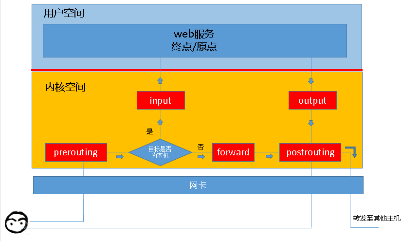
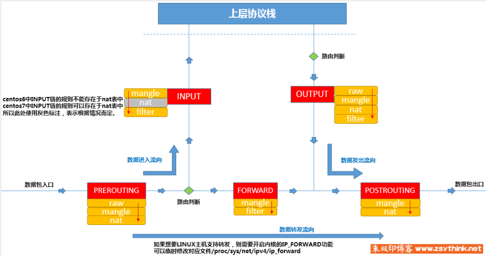

## 当前配置目录

``` sh
# ipam 默认目录
/var/lib/mydocker/network/ipam/
# ipam json 文件 ——  subnet名称和对应的bitmap形式的 ip 分配情况
cat /var/lib/mydocker/network/ipam/subnet.json

# network 默认目录
/var/lib/mydocker/network/network
# 文件名称就是对应的 network 名称，记录（网络名称，ip段、驱动名称），如 testbr0 
cat /var/lib/mydocker/network/network/testbr0
```


## 3. 测试创建网桥分配 ip 和删除网桥

### 实现流程

1. create：创建网络

   - 首先是使用 IPAM 分配 IP（注意网段前后不可分配，如 192.168.0.0/24  中 192.168.0.0（一般用于表示网段，配置到路由表中），192.168.0.255 表示广播地址；所以网关IP 一般为可分配的第一位，就是 192.168.0.1/24）

   - 然后根据 driver 找到对应的 NetworkDriver 并创建网络（这里只实现了 bridge driver，所以采用此 driver 创建网络设备并配置上网关IP）

   - 最后将网络信息保存到文件（当前默认存储路径为 `/var/lib/mydocker/network/network/`,文件名称为网络名称）
   - 

2. list：查看当前所有网络信息

   - 扫描网络配置的目录`/var/lib/mydocker/network/network/`拿到所有的网络配置信息并打印即可

3. remove：删除网络

   - 先调用 IPAM 去释放网络所占用的网关 IP
   - 然后调用网络驱动去删除该网络创建的一些设备与配置
   - 最终从网络配置目录中删除网络对应的配置文件
   - 

### 测试

``` sh
root@dfy-1:/go-code/my-docker#
# 1. 使用 bridge 驱动，创建网络，同时指定网段为 192.168.0.0/24，创建出的网桥名称为 testbr0
root@dfy-1:/go-code/my-docker# ./my-docker network create --subnet 192.168.0.0/24 --driver bridge testbr0
{"level":"debug","msg":"Allocate IP ... ...","time":"2025-03-13T17:11:17+08:00"}
{"level":"debug","msg":"Dump Network-IPAM-Info to File: /var/lib/mydocker/network/ipam/subnet.json","time":"2025-03-13T17:11:17+08:00"}
{"level":"debug","msg":"Allocate IP Finish —— subnet: 192.168.0.1/24, get free ip: 192.168.0.1","time":"2025-03-13T17:11:17+08:00"}
{"level":"debug","msg":"initBridge gatewayIP: 192.168.0.1/24","time":"2025-03-13T17:11:17+08:00"}
{"level":"debug","msg":"Dump Network-testbr0-Info to File: /var/lib/mydocker/network/network/testbr0","time":"2025-03-13T17:11:17+08:00"}
# 查看 ip 分配情况，192.168.0.0 网段（一般配置到路由表中） 192.168.0.255（广播地址），这两个 IP 默认是不分配的，也就是第一位和最后一位默认置为1
# 因此分配的 IP 为 192.168.0.1，也就是网关 IP
root@dfy-1:/go-code/my-docker# cat /var/lib/mydocker/network/ipam/subnet.json
{"192.168.0.0/24":"1100000000000000000000000000000000000000000000000000000000000000000000000000000000000000000000000000000000000000000000000000000000000000000000000000000000000000000000000000000000000000000000000000000000000000000000000000000000000000000000000000000000000001"}
# 创建的网络信息存储在宿主机以此网络命名的文件中， ////AA== 是 base64编码，表示 24
root@dfy-1:/go-code/my-docker# cat /var/lib/mydocker/network/network/testbr0
{"Name":"testbr0","IPRange":{"IP":"192.168.0.1","Mask":"////AA=="},"Driver":"bridge"}root@dfy-1:/go-code/my-docker#
root@dfy-1:/go-code/my-docker#
# 可以看出，创建出 网桥testbr0
root@dfy-1:/go-code/my-docker# ip link show
1: lo: <LOOPBACK,UP,LOWER_UP> mtu 65536 qdisc noqueue state UNKNOWN mode DEFAULT group default qlen 1000
    link/loopback 00:00:00:00:00:00 brd 00:00:00:00:00:00
2: enp0s5: <BROADCAST,MULTICAST,UP,LOWER_UP> mtu 1500 qdisc fq_codel state UP mode DEFAULT group default qlen 1000
    link/ether 00:1c:42:1d:ce:71 brd ff:ff:ff:ff:ff:ff
18: testbr0: <BROADCAST,MULTICAST,UP,LOWER_UP> mtu 1500 qdisc noqueue state UNKNOWN mode DEFAULT group default qlen 1000
    link/ether 86:d6:cf:f0:55:38 brd ff:ff:ff:ftestbr0
# 查看网桥 IP，使我们想要配置的 192.168.0.1/24，后面 192.168.0.255 表示广播地址
root@dfy-1:/go-code/my-docker# ip addr show testbr0
18: testbr0: <BROADCAST,MULTICAST,UP,LOWER_UP> mtu 1500 qdisc noqueue state UNKNOWN group default qlen 1000
    link/ether 86:d6:cf:f0:55:38 brd ff:ff:ff:ff:ff:ff
    inet 192.168.0.1/24 brd 192.168.0.255 scope global testbr0
       valid_lft forever preferred_lft forever
    inet6 fe80::84d6:cfff:fef0:5538/64 scope link
       valid_lft forever preferred_lft forever
root@dfy-1:/go-code/my-docker#
# 2. 查看网络，符合上面的创建信息
root@dfy-1:/go-code/my-docker# ./my-docker network list
{"level":"debug","msg":"Try load Network-testbr0-ConfigFile: /var/lib/mydocker/network/network/testbr0","time":"2025-03-13T17:14:29+08:00"}
NAME        IPRange          Driver
testbr0     192.168.0.1/24   bridge

# 3. 删除网络
root@dfy-1:/go-code/my-docker# ./my-docker network remove testbr0
{"level":"debug","msg":"Try load Network-testbr0-ConfigFile: /var/lib/mydocker/network/network/testbr0","time":"2025-03-13T17:12:06+08:00"}
{"level":"debug","msg":"DeleteNetwork net info: IPRange: 192.168.0.1/24, IP: 192.168.0.1","time":"2025-03-13T17:12:06+08:00"}
{"level":"debug","msg":"Release IP ... ...","time":"2025-03-13T17:12:06+08:00"}
{"level":"debug","msg":"Try load Network-IPAM-ConfigFile: /var/lib/mydocker/network/ipam/subnet.json","time":"2025-03-13T17:12:06+08:00"}
{"level":"debug","msg":"Dump Network-IPAM-Info to File: /var/lib/mydocker/network/ipam/subnet.json","time":"2025-03-13T17:12:06+08:00"}
{"level":"debug","msg":"Release IP Finish —— subnet: 192.168.0.0/24, release ip: 192.168.0.1","time":"2025-03-13T17:12:06+08:00"}
# IP 释放正确
root@dfy-1:/go-code/my-docker# cat /var/lib/mydocker/network/ipam/subnet.json
{"192.168.0.0/24":"1000000000000000000000000000000000000000000000000000000000000000000000000000000000000000000000000000000000000000000000000000000000000000000000000000000000000000000000000000000000000000000000000000000000000000000000000000000000000000000000000000000000000001"}
# 网络存储信息也移除了
root@dfy-1:/go-code/my-docker# cat /var/lib/mydocker/network/network/testbr0
cat: /var/lib/mydocker/network/network/testbr0: No such file or directory
```


## 4. 修复网桥bug

### 4.1  创建网桥过程

1. 创建网桥设备

   - ``` sh
     # ip link show
     33: testbridge: <BROADCAST,MULTICAST,UP,LOWER_UP> mtu 1500 qdisc noqueue state UNKNOWN mode DEFAULT group default qlen 1000
         link/ether 96:1f:26:a7:a6:1c brd ff:ff:ff:ff:ff:ff
     ```

2. 申请 IP，为网桥配置网关 IP；并启动网桥设备（UP状态表示 已启动）

   - ``` sh
     # 此处 网桥IP 为 10.0.0.1/24 
     # 由于掩码 24，所以可以算出负责的网段为 10.0.0.0/24 
     # 10.0.0.255 为广播地址
     root@ubuntu20:/go-code/my-docker# ip addr show testbridge
     33: testbridge: <BROADCAST,MULTICAST,UP,LOWER_UP> mtu 1500 qdisc noqueue state UNKNOWN group default qlen 1000
         link/ether 96:1f:26:a7:a6:1c brd ff:ff:ff:ff:ff:ff
         inet 10.0.0.1/24 brd 10.0.0.255 scope global testbridge
            valid_lft forever preferred_lft forever
         inet6 fe80::941f:26ff:fea7:a61c/64 scope link
            valid_lft forever preferred_lft forever
     ```

3. 添加 iptables SNAT 规则（用于使用该网桥的容器，将数据包发送到外网时，将容器 IP 转换为 宿主机 IP）

   - ``` sh
     # 表示非发送到当前网桥的数据包（非网桥内数据包），都进行 SNAT 转换
     # 出宿主机时，会经过该链的过滤，进行 SNAT 转换（将容器 IP 转为 宿主机IP，因为外部不认识容器 IP，若采用容器 IP 会导致回包收不到）
     root@ubuntu20:/go-code/my-docker# iptables-save | grep test
     -A POSTROUTING -s 10.0.0.0/24 ! -o testbridge -j MASQUERADE
     ```

4. 添加路由规则（为了将外部数据回包正确转发到容器中）

   - ``` sh
     # 上面进行 SNAT 转换后，宿主机可以正确收到数据回包，将其 IP 转为容器 IP（NAT 的 conntrack 机制）
     # conntrack 会记录发送的信息（跟踪五元组（源 IP、源端口、目标 IP、目标端口、协议）），进行转换和反转换
     # 因此回包到宿主机后，会转为容器 IP，但宿主机不知道容器 IP 在哪？
     # 此时就依赖路由了 —— 需要配置个路由，将此容器网段的数据包转发到网桥（网桥上通过广播，会知道将数据包发给哪个容器）
     # 下面路由 就是说明 发送给 10.0.0.0/24 网段的数据包，发到 10.0.0.1 IP（也就是网桥）
     root@ubuntu20:/go-code/my-docker# ip r
     default via 10.211.55.1 dev enp0s5 proto dhcp src 10.211.55.3 metric 100
     10.0.0.0/24 dev testbridge proto kernel scope link src 10.0.0.1
     # 另外需要有一点，要十分注意！！！
     # 转发到外网的数据包，需要在宿主机上开启转发功能，就是执行下面命令
     sysctl net.ipv4.conf.all.forwarding=1
     # 查看配置结果 
     root@ubuntu20:/go-code/my-docker# sysctl net.ipv4.conf.all.forwarding
     net.ipv4.conf.all.forwarding = 1
     # 重点！！！ 开启此配置后，创建网桥时，会自动添加上面的转发路由，因此不需要在代码中手动添加路由（会重复，导致报错）
     # 另外注意，该功能开启前，已创建的网桥，不会产生转发路由
     # 因此已创建的网桥，需要手动配置上面路由；或删除网桥进行重建
     ```

### 4.2 删除网桥过程

1. 清理路由规则
2. 清理iptables SNAT 规则
3. 删除网桥设备

### 4.3 iptables 简单介绍

- [iptables 使用方式整理](https://blog.konghy.cn/2019/07/21/iptables/)
- [iptables详解（1）：iptables概念](https://www.zsythink.net/archives/1199)





链(chains)是数据包传输的路径，对应着前面提到的报文处理的五个阶段，也相当于是五个不同的关卡：

- **INPUT：** 处理入站数据包，当接收到访问本机地址的数据包(入站)时，应用此链中的规则
- **OUTPUT：** 处理出站数据包，当本机向外发送数据包(出站)时，应用此链中的规则
- **FORWARD：** 处理转发数据包，当接收到需要通过本机发送给其他地址的数据包(转发)时，应用此链中的规则
- **PREROUTING：** 在对数据包作路由选择之前，应用此链中的规则
- **POSTROUTING：** 在对数据包作路由选择之后，应用此链中的规则

链是规则的容器，一条链中可能包含着众多的规则，当一个数据包到达一个链时，iptables 就会从链中第一条规则开始匹配，如果满足该规则的条件，系统就会根据该条规则所定义的方法处理该数据包，否则将继续匹配下一条规则，如果该数据包不符合链中任一条规则，iptables 就会根据该链预先定义的默认策略来处理数据包。

INPUT, OUTPUT 链更多的应用在本机的网络控制中，即主要针对本机进出数据的安全控制。而 FORWARD, PREROUTING, POSTROUTING 链更多地应用在对我的网络控制中，特别是机器作为网关使用时的情况。

表是链的容器，不同的表中包含着不同的链：

**Filter 表** 是 iptables 的默认表，因此如果没有指定表，那么默认操作的是 filter 表，其包含以下三种内建链：

- INPUT 链 – 处理来自外部的数据
- OUTPUT 链 – 处理向外发送的数据
- FORWARD 链 – 将数据转发到本机的其他网卡设备上

**NAT 表** 包含以下三种内建链：

- PREROUTING 链 – 处理刚到达本机并在路由转发前的数据包。它会转换数据包中的目标 IP 地址（destination ip address），通常用于 DNAT(destination NAT)
- POSTROUTING 链 – 处理即将离开本机的数据包。它会转换数据包中的源 IP 地址（source ip address），通常用于 SNAT（source NAT）
- OUTPUT 链 – 处理本机产生的数据包

**Mangle 表** 指定如何处理数据包。它能改变 TCP 头中的 QoS 位。Mangle 表包含五种内建链：PREROUTING, OUTPUT, FORWARD, INPUT, POSTROUTING.

**Raw 表** 包含两个内建链：PREROUTING, OUTPUT.

### 4.4  iptables SNAT 如何正确将回包转为容器 IP(根据 conntrack 记录进行转换)

容器 IP 经过 **SNAT（Source Network Address Translation）** 转换为宿主机 IP 后，回包的正确转换依赖于 **NAT 映射表**，主要由 **iptables 的 conntrack 机制** 维护。

------

#### **如何确保回包正确转换为容器 IP？**

当数据包从容器（`10.0.0.2`）出去后，SNAT 规则会把源 IP **转换为宿主机 IP（如 `192.168.1.100`）**。当目标服务器（外部 IP，如 `8.8.8.8`）返回数据时，需要确保回包能正确映射回容器。

#### **1. 依赖 `iptables` 和 `conntrack`**

SNAT 主要由 **`POSTROUTING` 链** 规则实现：

```sh
iptables -t nat -A POSTROUTING -s 10.0.0.0/24 ! -o testbridge -j MASQUERADE
```

- `-s 10.0.0.0/24` ：匹配容器的 IP 段
- `! -o testbridge` ：确保流量是发往外部的（不在 bridge 内部）
- `-j MASQUERADE` ：动态替换源 IP 为宿主机外网 IP

**`conntrack` 机制** 记录 NAT 连接映射：

```sh
conntrack -L
```

查看是否有：

```
tcp      6 431995 ESTABLISHED src=10.0.0.2 dst=8.8.8.8 sport=50000 dport=443 \
    src=8.8.8.8 dst=192.168.1.100 sport=443 dport=50000 [ASSURED]
```

表示：

- **出站时**：10.0.0.2 → 8.8.8.8，源 IP 改为 192.168.1.100
- **回包时**：8.8.8.8 → 192.168.1.100，`conntrack` 还原回 10.0.0.2

------

#### **2. 确保 `iptables` 规则正确**

查看 `iptables -t nat -L -n -v` 是否包含 SNAT 规则：

```sh
iptables -t nat -L POSTROUTING -n -v
```

如果没有，则需要：

```sh
iptables -t nat -A POSTROUTING -s 10.0.0.0/24 -j MASQUERADE
```

> **注意**：如果宿主机有多个出口（多网卡），建议使用 `-o eth0` 指定出口网卡，避免错误转换。

------

#### **3. 确保 `conntrack` 工作正常**

如果 `conntrack` 表满，可能导致 NAT 失效，检查：

```sh
sysctl net.netfilter.nf_conntrack_max
sysctl net.netfilter.nf_conntrack_count
```

若 `nf_conntrack_count` 逼近 `nf_conntrack_max`，需要调整：

```sh
sysctl -w net.netfilter.nf_conntrack_max=262144
```

------

#### **总结**

确保回包正确转换回容器 IP，需要：

1. **iptables SNAT 规则**（`POSTROUTING MASQUERADE`）。
2. **conntrack 记录 NAT 映射**（`conntrack -L`）。
3. **调整 conntrack 最大表项**，避免 NAT 失效。

这样，SNAT 处理的流量就可以正确回到容器！ 🚀

### 4.4 若是多个容器都发送到同一个地址，SNAT 是如何将回包还原为容器 IP，根据端口吗

是的，**SNAT（Source NAT）** 主要依赖于 **`conntrack` 连接跟踪机制**，通过 **五元组（Five-Tuple）** 来区分不同容器的回包，并正确还原源 IP。

------

#### **🔹 多个容器访问同一目标地址，如何正确还原？**

假设多个容器访问同一个目标地址（如 `8.8.8.8`），它们的 IP 和端口如下：

| **容器 IP** | **源端口 (sport)** | **目标 IP (dst)** | **目标端口 (dport)** |
| ----------- | ------------------ | ----------------- | -------------------- |
| `10.0.0.2`  | `50001`            | `8.8.8.8`         | `443` (HTTPS)        |
| `10.0.0.3`  | `50002`            | `8.8.8.8`         | `443` (HTTPS)        |

当流量经过 SNAT，源 IP 被修改为宿主机出口 IP（如 `192.168.1.100`），但 **源端口（sport）通常保持不变或动态分配**：

| **NAT后源 IP**  | **NAT后源端口 (sport)** | **目标 IP (dst)** | **目标端口 (dport)** |
| --------------- | ----------------------- | ----------------- | -------------------- |
| `192.168.1.100` | `50001`                 | `8.8.8.8`         | `443` (HTTPS)        |
| `192.168.1.100` | `50002`                 | `8.8.8.8`         | `443` (HTTPS)        |

------

#### **🔹 回包时如何映射回正确的容器？**

当 `8.8.8.8` 发送回包时：

| **回包源 IP** | **回包源端口 (sport)** | **回包目标 IP (dst)** | **回包目标端口 (dport)** |
| ------------- | ---------------------- | --------------------- | ------------------------ |
| `8.8.8.8`     | `443`                  | `192.168.1.100`       | `50001`                  |
| `8.8.8.8`     | `443`                  | `192.168.1.100`       | `50002`                  |

**conntrack 机制** 维护了 SNAT 连接跟踪表：

```sh
conntrack -L
```

输出类似：

```
tcp      6 431995 ESTABLISHED src=10.0.0.2 dst=8.8.8.8 sport=50001 dport=443 \
    src=8.8.8.8 dst=192.168.1.100 sport=443 dport=50001 [ASSURED]
tcp      6 431995 ESTABLISHED src=10.0.0.3 dst=8.8.8.8 sport=50002 dport=443 \
    src=8.8.8.8 dst=192.168.1.100 sport=443 dport=50002 [ASSURED]
```

这样：

1. **conntrack 识别回包目标 IP (`192.168.1.100`) 和目标端口 (`50001`/`50002`)**
2. **根据 NAT 记录，回包正确映射回 `10.0.0.2:50001` 或 `10.0.0.3:50002`**
3. **容器收到正确的响应**

------

#### **🔹 结论**

✔ **SNAT 主要依靠 `conntrack` 跟踪五元组**（源 IP、源端口、目标 IP、目标端口、协议）。
 ✔ **不同容器的回包是通过端口映射回去的**，即 **目的 IP+端口 → 原始容器 IP+端口**。
 ✔ **`iptables` NAT 规则配合 `conntrack`，确保多个容器可以正确接收回包**。 🚀


