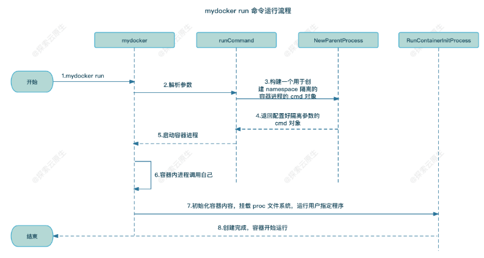
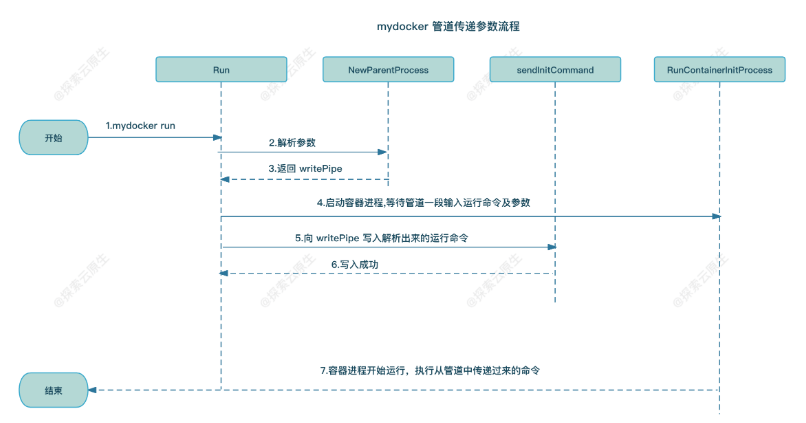
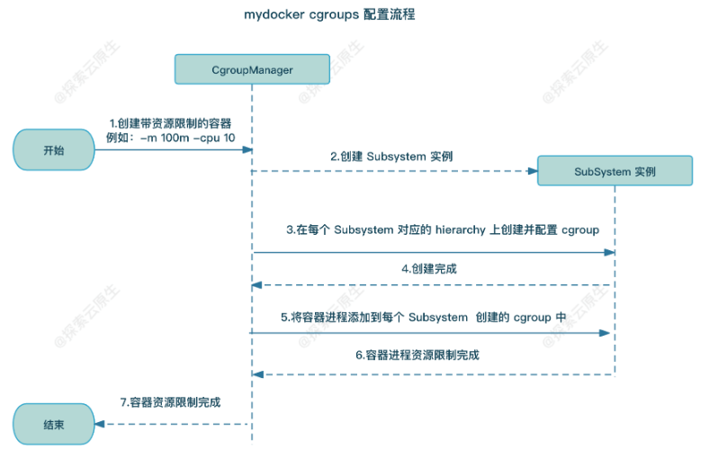

## 参考

- 《动手写 docker》
- [从零开始写 Docker(一)---实现 mydocker run 命令 -](https://www.lixueduan.com/posts/docker/mydocker/01-mydocker-run/)

## 1 | 设计思路



- 1）流程开始，用户手动执行 mydocker run 命令
  - 例如 mydocker run -it /bin/sh
    - 首先对该 cmd 对象进行分解，进行初步了解
    - command 部分为 mydocker run （ 此处表示执行 mydocker 程序的 run 逻辑部分）
    - flags 部分为 -it  (flags 可以理解为命令的可选功能，此处就是将进程的输入输出展示到终端上)
    - args 部分为 /bin/sh
- 2）urfave/cli 工具解析传递过来的参数
- 3）解析完成后发现第一个参数是 run，于是执行 run 命令，调用 runCommand 方法，该方法中继续调用 NewParentProcess 函数构建一个 cmd 对象
  - 以上面为例
  - Mydocker run 会调用 runCommand 方法，继续调用 NewParentProcess 函数，
    - NewParentProcess 函数，会重新构建一个 cmd 命令对象（增加 init 逻辑），新建的 cmd 命令对象会构建一个隔离的 namespace 空间，并增加 init 逻辑的触发
    - 新建的 cmd 对象为 /proc/self/exe init /bin/sh，command 部分为  /proc/self/exe init（就相当于 mydocker init），args 保持不变，为用户传入的（/bin/sh)
    - 同时该命令 mydocker run 为该 cmd 配置了一些属性，如固定要配置的属性（ mnt/net/uts/pid/ipc 等 namespace），和一些可选的属性（由 flags 参数控制，如输入输出重定向等，-it 是控制是否将输入输出转到标准输出（也就是终端上））
    - 因此该 cmd 对象运行后，就相当于利用 namespace 机制创建一个隔离的进程空间，在该进程空间内执行的是（/proc/self/exe init 逻辑），也就是（mydocker 的 init 逻辑），
- 4）NewParentProcess 将构建好的 cmd 对象返回给 runCommand 方法
- 5）runCommand 方法中调用 cmd.exec 执行上一步构建好的 cmd 对象
- 6）容器启动后，根据 cmd 中传递的参数，/proc/self/exe init 实则最终会执行 mydocker init 命令，初始化容器环境
  - 因此该 cmd 对象运行后，就相当于利用 namespace 机制创建一个隔离的进程空间，在该进程空间内执行的是（/proc/self/exe init 逻辑），也就是（mydocker 的 init 逻辑）
  - 但有个问题，在该进程内部 mydocker  init 是 PID 1 进程，但实际上 PID 1 应该为用户进程，也就是 /bin/sh
    - 因此 mydocker  init 对应的逻辑，就是将通过 exec 系统调用，将 PID 1 的进程替换为用户程序（也就是 /bin/sh）
- 7）init 命令内部实现就是通过 mount 命令挂载 proc 文件系统
  - proc 文件系统中的文件是内核自动生成，保存的是进程信息，通过 ps 可以查看；若没有再次挂载，通过 ps 查看到的将会是宿主机上的所有进程；再次挂载后，便可以看到容器进程内的进程信息
- 8）容器创建完成，整个流程结束


## 2 | 优化用户参数输入（采用匿名管道）

> **如果用户输入参数特别长，或者里面有一些特殊字符时该方案就会失效**。
>
> 因此，我们对这部分逻辑进行优化，**使用管道来实现父进程和子进程之间的参数传递**。



- 父进程创建匿名管道，得到 readPiep FD 和 writePipe FD；
  - run 命令对应的进程，在匿名通道中写入参数
  - init 命令对应的进程，读取匿名通道中的参数
- 父进程中构造 cmd 对象时通过`ExtraFiles` 将 readPiep FD 传递给子进程
- 父进程启动子进程后将命令通过 writePipe FD 写入子进程
- 子进程中根据 index 拿到对应的 readPipe FD
- 子进程中 readPipe FD 中读取命令并执行


**匿名管道是一种特殊的文件描述符，用于在父进程和子进程之间创建通信通道**。

有以下特点：

- 管道有一个固定大小的缓冲区，一般是4KB。
- 这种通道是单向的，即数据只能在一个方向上流动。
- 当管道被写满时，写进程就会被阻塞，直到有读进程把管道的内容读出来。
- 同样地，当读进程从管道内拿数据的时候，如果这时管道的内容是空的，那么读进程同样会被阻塞，一直等到有写进程向管道内写数据。


## 3. 优化用户输入（简短命令）

- 支持用户输入 sh，而不是完全路径 /bin/sh
  - 原理 —— 在 PATH 环境变量中，搜索 sh 来知晓完全路径

``` sh
cmdPath, err := exec.LookPath(cmdArray[0])
```


## 4. 配置容器资源限制



- 1）解析命令行参数，取到 Cgroups 相关参数
  - 比如 -mem 100m 表示把内存限制到 100m
  - 又比如 -cpu 20 表示把 cpu 限制在 20%
- 2）根据参数，创建对应 Cgroups 并配置对应的 subsystem，最后把 fork 出来的子进程 pid 加入到这个 Cgroups 中即可。
  - 1）创建 Cgroups
    - 根据 `/proc/self/mountinfo` 中的信息，搜索对应资源的挂载点，如（memory）对应 /sys/fs/cgroup/memory
    - 之后在此路径下创建负责管控容器进程的 Cgroup，如  /sys/fs/cgroup/memory/mydocker-cgroup
  - 2）配置 subsystem
    - 将 init 进程 PID（也是容器进程，因为后续容器进程会替换 init 进程运行文件，但继承其 PID)，写入到 Cgroup 对应的 tasks 文件中，用于限制后续限制该进程
    - 将资源限额写入到 Cgroup 对应的文件中，如 memory 对应 memory.limit_in_bytes
- 3）子进程(容器)结束时删除对应的 Cgroup

几个重要的点如下：

- 1）找到 cgroup 挂载路径：根据 `/proc/self/mountinfo` 中的信息，按规则解析得到 cgroup 挂载路径
- 2）各个 Subsystem 的实现：使用 Go 实现 Cgroups 配置
  - 在指定位置创建目录
  - 往对应文件写入配置等